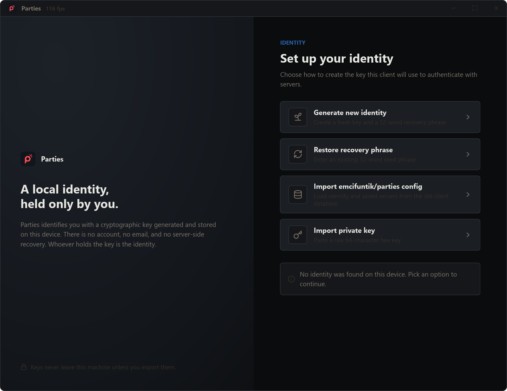
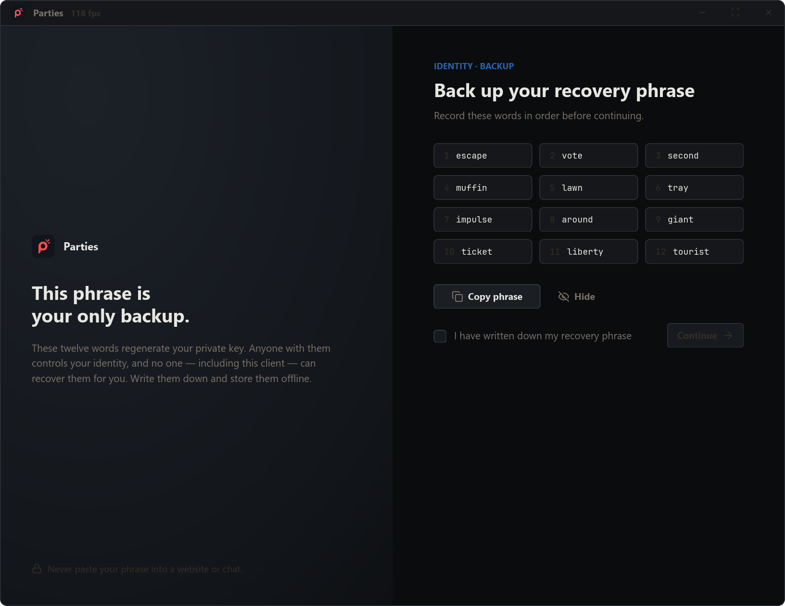
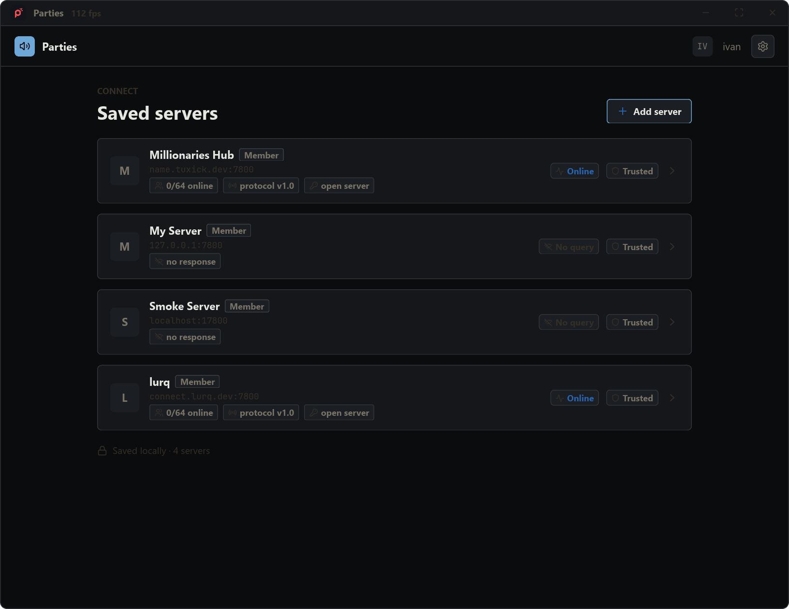
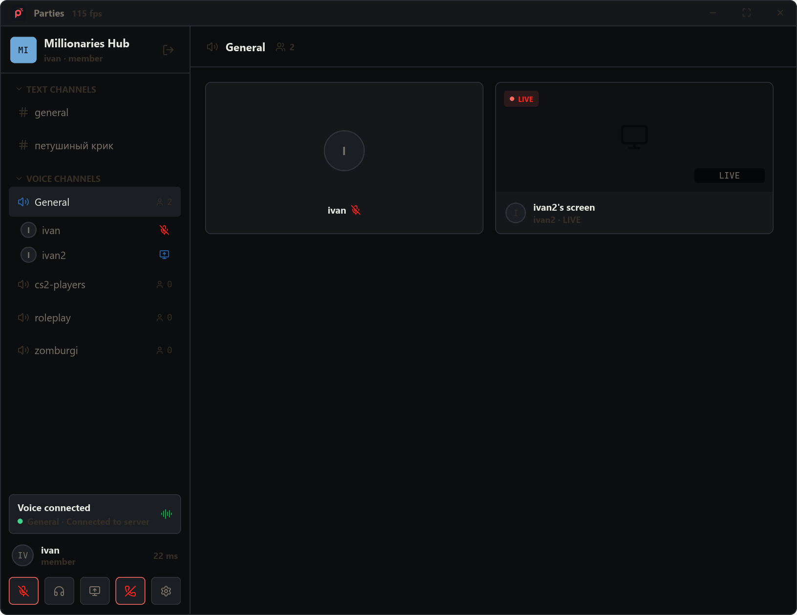
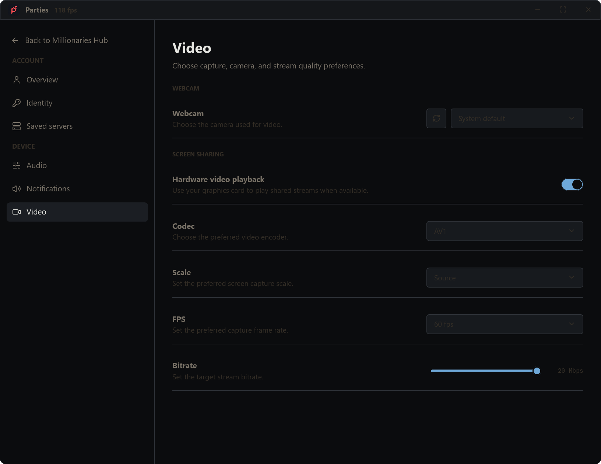
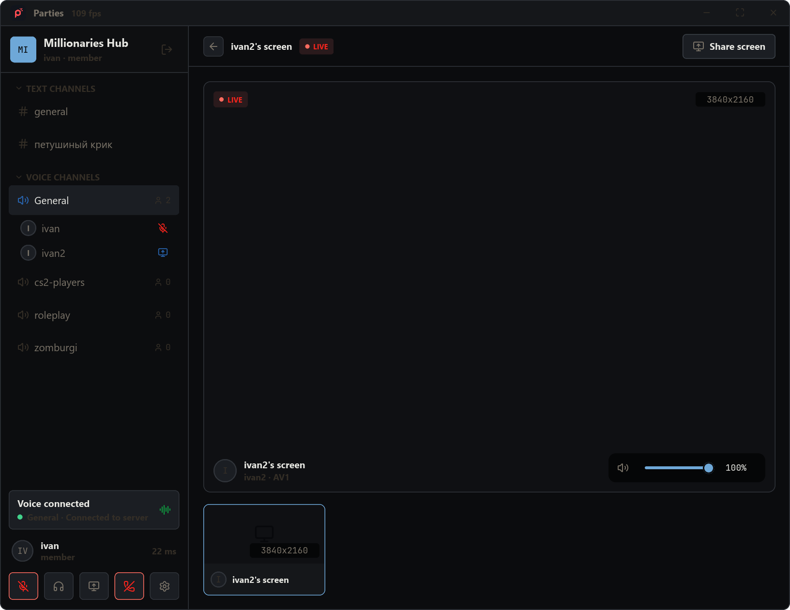
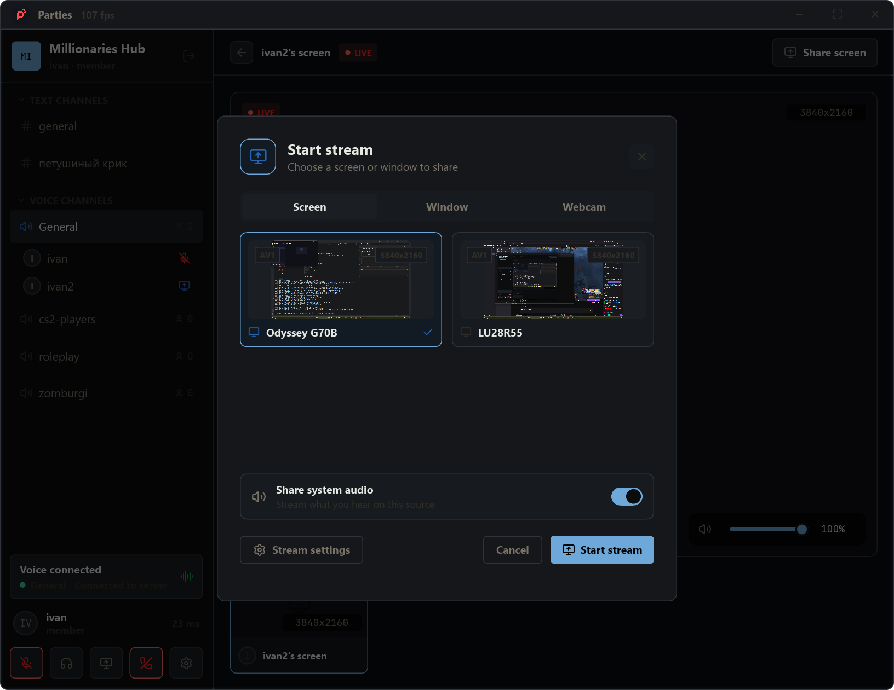

# parties-rs

`parties-rs` is a custom desktop client for [emcifuntik/parties](https://github.com/emcifuntik/parties). It is not the upstream client; this repo exists primarily to test, stress, and optimize [Lurq](https://crates.io/crates/lurq) in a real desktop application with voice, chat, streaming, custom window chrome, media-heavy UI, and release automation.

The Cargo package is named `client`, but the built app and release artifacts are still named `parties-rs`.

## Screenshots

### Startup



### Generate Identity



### Server Selection



### Lobby



### Settings



### Streaming



### Share Screen



## What It Includes

- Native desktop client built with `lurq`.
- Identity setup and restore flows.
- Saved server management.
- Text chat and chat command support.
- Voice channels with mute, deafen, push-to-talk, and device settings.
- Screen, window, and webcam streaming.
- Windows and macOS native media paths.
- Sentry crash reporting and Windows PDB upload.
- GitHub release pipeline for Windows and macOS client builds.
- Server plugin ABI crate.
- SoundCloud-backed music bot plugin.

## Workspace

```text
crates/client         Desktop client package; builds the parties-rs binary.
crates/server-plugin  Rust ABI/helpers for Parties server plugins.
crates/music-bot      Server plugin that provides music playback commands.
docs/                 Architecture, development, release, and reference docs.
```

## Quickstart

```powershell
cargo build --package client
cargo test --workspace
```

For a Windows release build with PDBs:

```powershell
$env:CARGO_PROFILE_RELEASE_DEBUG = "2"
cargo build --release --target x86_64-pc-windows-msvc --package client
```

## Documentation

Start with [docs/index.md](docs/index.md).

Useful entry points:

- [Overview](docs/overview.md)
- [Capabilities](docs/capabilities.md)
- [Client Architecture](docs/architecture/client.md)
- [Video Architecture](docs/architecture/video.md)
- [Storage](docs/architecture/storage.md)
- [Release Pipeline](docs/development/release-pipeline.md)
- [Used Libraries](docs/reference/used-libraries.md)
